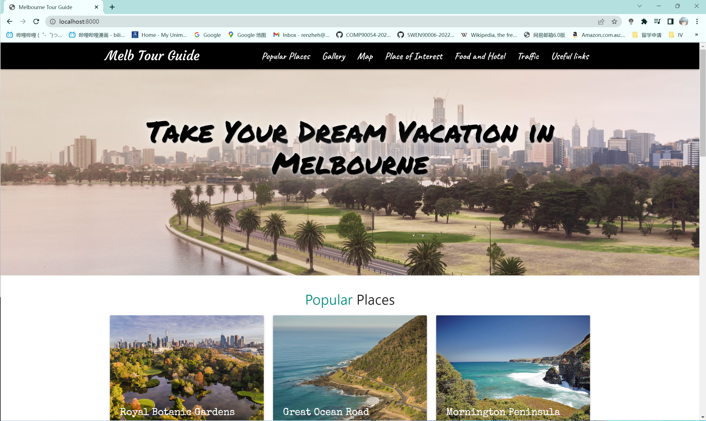

## How to run

- open cmd in PC
- cd into project
- run command: python -m http.server
- visit URL: http://localhost:8000

## Screen Shot

## Four part of code

- HTML

  you can find the html code directly in the folder

- poi

  implemented by Tableau, in the folder `poi_code`

- traffic

  implemented by R shiny, in the folder `traffic_code`

- food_hotel

  implemented by Tableau, in the folder `food_and_hotel_code`

## GitHub URL

https://github.com/keruru0987/IV_A3

